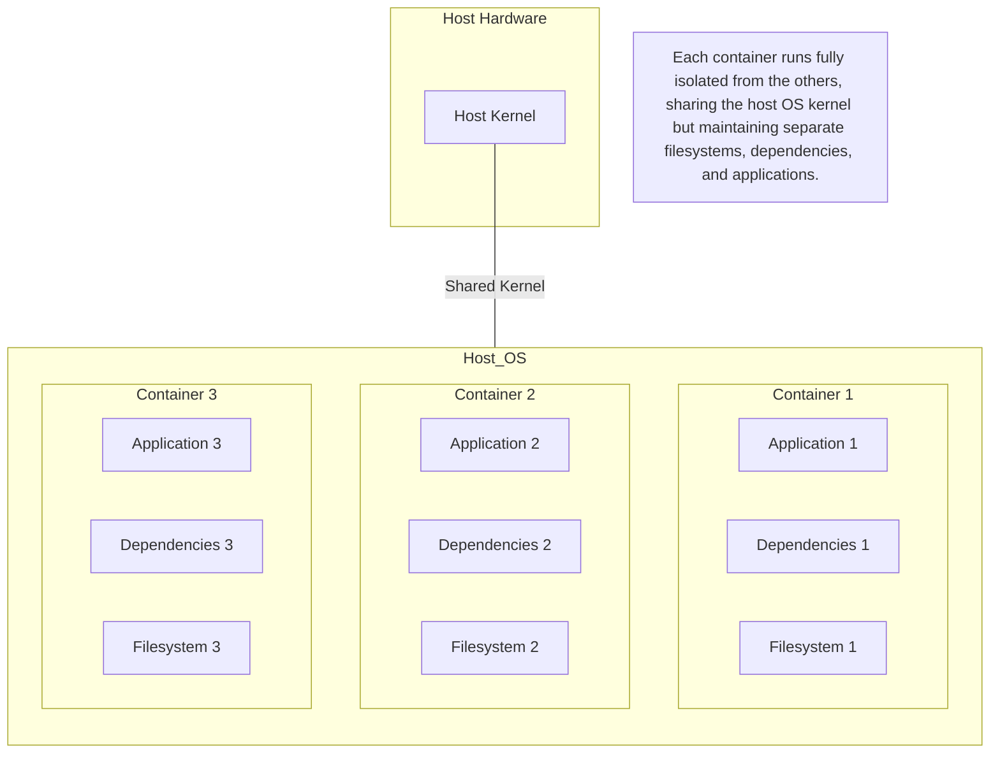
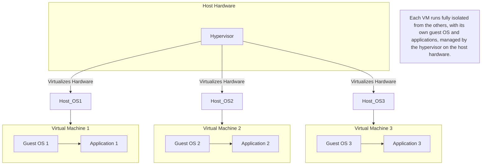

## What is Docker?
- Opensource project for buildling, shipping and running programs
- simplifies and standardizes software packaging, distribution, and execution through efficient process containers and user-friendly tooling.
- It accomplishes using an OS technology called Containers

## Containers

### What Are Containers?

Containers are lightweight, standalone, and executable software packages that include everything needed to run a piece of software, including the code, runtime, libraries, and system tools. 

### Brief history
- Jail Concept:
    
    - Used in UNIX-style operating systems.
    - Describes a modified runtime environment.
    - Limits the scope of resources accessible to a program.
    - Originates from 1979.

- Evolution:

    - Jail features have evolved over time.
- Shift to Containers:

    - In 2005, Sun’s Solaris 10 introduced Solaris Containers.
    - "Container" became the preferred term for such environments.
- Expanded Goals:

    - Initially focused on limiting filesystem scope.
    - Now aims to isolate a process from all resources except those explicitly allowed.
    - Using containers was a best practice, but their manual creation was challenging and error-prone; Docker simplified this by providing consistent, secure containers built according to best practices.

### Key Features
- **Isolation**: Containers provide process and filesystem isolation, ensuring that the application runs in its own environment without interfering with other applications.
- **Portability**: Containers can run on any system that supports Docker, making it easy to move applications between different environments (e.g., development, testing, production).
- **Efficiency**: Containers share the host system's kernel and resources, making them more lightweight and faster to start compared to traditional virtual machines.
- **Scalable:** Easily scalable and manageable using orchestration tools like Kubernetes.

### Popular Containerization Tools
- **Docker:** Leading container platform providing tooling and ecosystem support.
- **Podman:** Alternative to Docker, not requiring a daemon.
- **rkt:** A security-focused container engine from CoreOS (now part of Red Hat).

### Use Cases
- **Microservices:** Running individual components of an application in isolated containers.
- **CI/CD Pipelines:** Streamlining the build, test, and deployment processes.
- **Dev/Test Environments:** Quickly spinning up isolated development and testing environments.

### Depicting isolation of containers

## Virtualization

### What is Virtualization?

Virtualization is the creation of a virtual version of something, such as computer hardware, storage devices, and network resources. It allows multiple virtual machines (VMs) to run on a single physical host.

### Key Features
- **Isolation:** VMs are completely isolated from each other, including their own OS and resources.
- **Encapsulation:** Each VM is encapsulated into files for easy backup, migration, and recovery.
- **Resource Allocation:** VMs can utilize the resources of the physical host, such as CPU, memory, and storage, with flexible allocation.
- **Versatility:** Can run different operating systems on the same hardware.

### Popular Virtualization Tools
- **VMware vSphere:** Comprehensive virtualization platform for managing VMs.
- **KVM (Kernel-based Virtual Machine):** Open-source virtualization technology embedded in Linux.
- **Hyper-V:** Microsoft's virtualization technology, integrated into Windows Server.

### Use Cases
- **Server Consolidation:** Running multiple virtual servers on a single physical machine.
- **Disaster Recovery:** Easy backup and replication of virtualized environments.
- **Legacy Application Support:** Running older applications on modern hardware.

### Depicting Virtualization on machine

## Are containers same as Virtualization?

| Aspect                   | Containers                              | Virtual Machines                  |
| ------------------------ | --------------------------------------- | --------------------------------- |
| **Resource Utilization** | More efficient, sharing the host kernel | Higher overhead, full OS per VM   |
| **Startup Time**         | Seconds                                 | Minutes                           |
| **Isolation**            | Process and file system level           | Full OS-level isolation           |
| **Use Case**             | Microservices, dev/test environments    | Legacy apps, server consolidation |
| **Portability**          | High portability                        | OS-specific images, less portable |

### When to Use What

- **Use Containers When:**
  - Developing and deploying microservices.
  - Needing quick iterations and deployments.
  - Prioritizing resource efficiency and speed.

- **Use Virtual Machines When:**
  - Running multiple applications with different OS requirements.
  - Isolating applications completely for security reasons.
  - Supporting legacy systems that require older environments.
