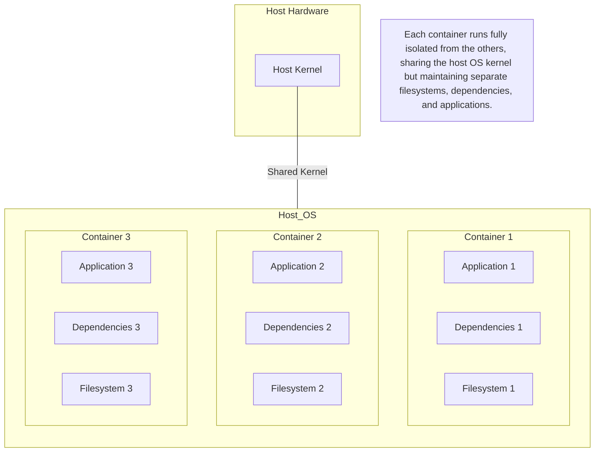
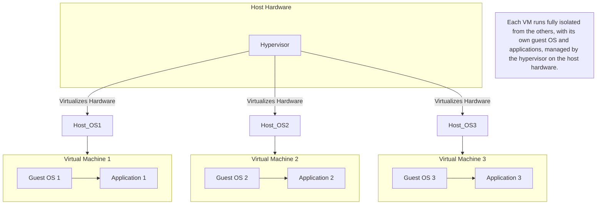

## What is Docker?

- Opensource project for buildling, shipping and running programs
- simplifies and standardizes software packaging, distribution, and execution through efficient process containers and user-friendly tooling.
- It accomplishes using an OS technology called Containers

## Containers

### What Are Containers?

Containers are lightweight, standalone, and executable software packages that include everything needed to run a piece of software, including the code, runtime, libraries, and system tools. 

### Brief history

- Jail Concept:
  - Used in UNIX-style operating systems.
  - Describes a modified runtime environment.
  - Limits the scope of resources accessible to a program.
  - Originates from 1979.

- Evolution:
  - Jail features have evolved over time.

- Shift to Containers:
  - In 2005, Sun’s Solaris 10 introduced Solaris Containers.
  - "Container" became the preferred term for such environments.
- Expanded Goals:

  - Initially focused on limiting filesystem scope.
  - Now aims to isolate a process from all resources except those explicitly allowed.
  - Using containers was a best practice, but their manual creation was challenging and error-prone; Docker simplified this by providing consistent, secure containers built according to best practices.

### Key Features

- **Isolation**: Containers provide process and filesystem isolation, ensuring that the application runs in its own environment without interfering with other applications.
- **Portability**: Containers can run on any system that supports Docker, making it easy to move applications between different environments (e.g., development, testing, production).
- **Efficiency**: Containers share the host system's kernel and resources, making them more lightweight and faster to start compared to traditional virtual machines.
- **Scalable:** Easily scalable and manageable using orchestration tools like Kubernetes.

### Popular Containerization Tools

- **Docker:** Leading container platform providing tooling and ecosystem support.
- **Podman:** Alternative to Docker, not requiring a daemon.
- **rkt:** A security-focused container engine from CoreOS (now part of Red Hat).

### Use Cases

- **Microservices:** Running individual components of an application in isolated containers.
- **CI/CD Pipelines:** Streamlining the build, test, and deployment processes.
- **Dev/Test Environments:** Quickly spinning up isolated development and testing environments.

### Depicting isolation of containers

## Virtualization

### What is Virtualization?

Virtualization is the creation of a virtual version of something, such as computer hardware, storage devices, and network resources. It allows multiple virtual machines (VMs) to run on a single physical host.

### Key Features

- **Isolation:** VMs are completely isolated from each other, including their own OS and resources.
- **Encapsulation:** Each VM is encapsulated into files for easy backup, migration, and recovery.
- **Resource Allocation:** VMs can utilize the resources of the physical host, such as CPU, memory, and storage, with flexible allocation.
- **Versatility:** Can run different operating systems on the same hardware.

### Popular Virtualization Tools

- **VMware vSphere:** Comprehensive virtualization platform for managing VMs.
- **KVM (Kernel-based Virtual Machine):** Open-source virtualization technology embedded in Linux.
- **Hyper-V:** Microsoft's virtualization technology, integrated into Windows Server.

### Use Cases

- **Server Consolidation:** Running multiple virtual servers on a single physical machine.
- **Disaster Recovery:** Easy backup and replication of virtualized environments.
- **Legacy Application Support:** Running older applications on modern hardware.

### Depicting Virtualization on machine

## Are containers same as Virtualization?

| Aspect                   | Containers                              | Virtual Machines                  |
| ------------------------ | --------------------------------------- | --------------------------------- |
| **Resource Utilization** | More efficient, sharing the host kernel | Higher overhead, full OS per VM   |
| **Startup Time**         | Seconds                                 | Minutes                           |
| **Isolation**            | Process and file system level           | Full OS-level isolation           |
| **Use Case**             | Microservices, dev/test environments    | Legacy apps, server consolidation |
| **Portability**          | High portability                        | OS-specific images, less portable |

### When to Use What

- **Use Containers When:**
  - Developing and deploying microservices.
  - Needing quick iterations and deployments.
  - Prioritizing resource efficiency and speed.

- **Use Virtual Machines When:**
  - Running multiple applications with different OS requirements.
  - Isolating applications completely for security reasons.
  - Supporting legacy systems that require older environments.

## Building Containers

Docker builds containers using 10 major system features.They are as follows

PID namespace — Process identifiers and capabilities
UTS namespace — Host and domain name
MNT namespace — Filesystem access and structure
IPC namespace — Process communication over shared memory
NET namespace — Network access and structure
USR namespace — User names and identifiers
chroot syscall —Controls the location of the filesystem root
cgroups — Resource protection
CAP drop — Operating system feature restrictions
Security modules — Mandatory access controls

## Shipping Containers

- Think of a Docker container as a physical container. It's like a box where an application and its dependencies are stored and run as an application.
- Just as physical containers are shipped by cranes, trains, ships, and trucks, Docker runs, copies, and distributes application containers.
- The application containers that are shipped by Docker are called as **Image**
- **Images** are the shippable units in the Docker ecosystem.
- Infrastructure components that simplify shipping/distributing containers are registries and indexes

### Registries

- A Docker registry is a storage and distribution system for Docker images. It allows developers to push (upload) images after building, and pull (download) images to use them in their environments.
  
#### Public Docker Registries

##### Docker Hub

- The most widely used public Docker registry.
- Provides free access to public images and limited private repositories.
- Users can host their own public or private images.

##### Other Public Registries

- **Google Container Registry (GCR)**
- **Amazon Elastic Container Registry (ECR)**
- **Azure Container Registry (ACR)**

#### Private Docker Registries

- Used for storing proprietary or sensitive images.
- Can be hosted on-premises or in the cloud.
- Popular options include:
  - **Harbor:** An open-source trusted cloud-native registry.
  - **JFrog Artifactory:** Universal repository manager with Docker support.

### Docker Indexes?

- An index is a service that keeps track of the images in a registry.
- Provides a searchable interface to find and manage Docker images.
- Docker Hub itself includes an index of all available images.
- Functions of Docker Index
  - Organization: Categorizes and lists available images.
  - Search: Allows users to search for specific images based on names, tags, or other metadata.

## What problems does Docker solve ?

### 1. Environment Inconsistency

#### Problem

- **Development vs. Production:** Applications often behave differently in production than in a developer's local environment due to differences in OS, libraries, and configurations.
- **"It works on my machine" Syndrome:** The common scenario where software works perfectly on a developer's machine but fails in other environments.

#### Solution with Docker

- **Consistency:** Docker ensures that applications run the same irrespective of where they are deployed—whether on a developer's laptop, a test server, or a production environment.
- **Isolation:** Containers encapsulate all dependencies, libraries, configuration files, execution environment, and the application code itself.

### 2. Dependency Management

#### Problem

- **Complex Dependencies:** Modern applications often require specific versions of libraries and tools. Managing these dependencies across multiple environments is challenging.
- **Dependency Conflicts:** When multiple applications require different versions of the same dependency, conflicts can arise.

#### Solution with Docker

- **Encapsulation:** Each Docker container includes its own set of dependencies, libraries, and binaries, ensuring no conflict between the applications.
- **Isolation:** Containers run in separate environments, preventing clashes between different dependencies.

### 3. Resource Efficiency

#### Problem

- **Overhead of Virtual Machines:** Running multiple virtual machines can be resource-intensive as each VM includes a full operating system instance, leading to significant overhead.
- **Inefficiency in Managing Resources:** Traditional VMs are less efficient in resource allocation and utilization.

#### Solution with Docker

- **Lightweight Containers:** Docker containers share the host OS kernel, making them much lighter and faster to start compared to VMs.
- **Efficient Resource Utilization:** Containers can be packed efficiently on a single machine, maximizing resource utilization without the overhead of VMs.

### 4. Deployment and Scaling

#### Problem

- **Complex Deployment Scripts:** Deploying applications often involves complex, error-prone scripts.
- **Scalability Challenges:** Scaling applications manually or with traditional methods lacks efficiency and can be prone to errors.

#### Solution with Docker

- **Simplified Deployment:** Docker uses containers to encapsulate applications and dependencies, making deployment as simple as running a container.
- **Scalability:** Orchestration tools like Docker Swarm and Kubernetes can automatically manage container scaling, health, and distribution across clusters.

### 5. Isolation and Security

#### Problem

- **Shared Environment Risks:** Running multiple applications on the same host can lead to security risks and resource contention.
- **Lack of Isolation:** Without proper isolation, a compromised application can potentially affect others running on the same host.

#### Solution with Docker

- **Process Isolation:** Docker uses namespaces and control groups (cgroups) to ensure strong isolation between containers.
- **Security:** Containers isolate applications from each other and the host system, reducing the attack surface and potential for interference.

## States of Docker Containers

1. Created
2. Running
3. Restarting
4. Paused
5. Removing
6. Exited (used even if container has never been started)

## Entrypoint and Command in docker

- **Entrypoint:** The entrypoint is the command that is executed when a container is started.
- **Command:** The command is an additional command that can be passed to the entrypoint.