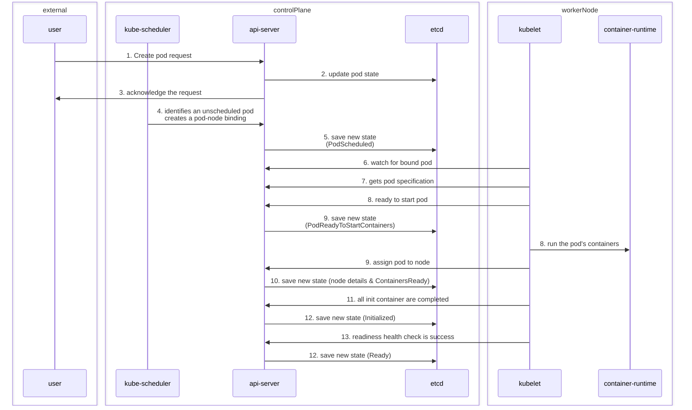

# Architecture

Kubernetes cluster : Control plane + worker machines
- Cluster needs atleast one worker machine to run pods

## Control Plane
- Responsible for container orchestration & maintaining desired state of the cluster
- Components in Control Plane:
  1. kube-apiserver
  2. etcd
  3. kube-scheduler
  4. kube-controller-manager
  5. cloud-controller-manager
- A cluster can have 1 or more control planes

## Worker Node
- Responsible for running containerized applications
- Components in Worker Node:
  1. kubelet
  2. kube-proxy
  3. container runtime

## Deep dive of components

### Control plane components

#### kube-apiserver
- Central hub of kubernetes cluster exposing kubernetes API
- Highly scalable
- Clients communicate with apiserver through HTTP APIs
- Communication happens through TLS to prevent unauthorized access to cluster
- Responsibilities:
  1. Exposes cluster APIs and handles all API requests
  2. Authentication & Authorization
  3. Coordinates control plane and worker nodes communication which happens through `gRPC/http`
  4. `kube-apiserver` initiates only connection to `etcd`. All other components connect to apiserver
  5. API server can also watch resources for any changes
  6. Each components independently watches the  `apiserver` to know what to do
- apiserver has builtin `apiserver-proxy`, primarily used to enable access to ClusterIP service from outside cluster
```bash
  kubectl proxy --port=8080
```

#### etcd
- Brain of kubernetes cluster storing config, state, metadata of kubernetes objects
- Distributed key-value store with strong consistency and availability
- Uses `raft consensus algorithm` to achieve strong consistency and availability
- Uses `primary-backup` or `master-slave` architecture
- Built on top of BboltDB (fork of boltDB)
- How does it work?
  1. etcd stores config, state, metadata of kubernetes objects
  2. Exposes watch() API to subscripe to events(changes in state of object)
  3. etcd exposes key-value API using `gRPC`
  4. stores all objects under `/registry` directory key in key-value format
- As it's follows master slave architecture, here is the general formula for fault tolerance for nodes:
  `fault_tolerance = (n-1)/2 `, n is number of nodes

#### kube-scheduler
- Responsible for scheduling pods on worker nodes
- Scheduler takes the specification(resource info, priorities, taints, ..) of the pod and selects the best node
for the pod satisfying the requested requirements

#### kube controller manager
- Responsibility of kube controller manager is to manage all the controllers and the controllers try to keep the cluster in the desired state
- In k8s, controllers are control loops that watch the state of k8s object, then make or request changes needed
- They ensure to keep the cluster in desired state
- Manager
- List of built-in controllers
  1. Deployment controller
  2. Replicaset controller
  3. Daemonset controller
  4. Job controller
  5. CronJob controller
  6. Endpoints controller
  7. Namespace controller
  8. Node controller

#### Cloud Controller Manager
- Acts a bridge between Cloud platform APIs and k8s cluster
- Helps in provisioning cloud resources for cluster like nodes, volumes, ...
- Manages lifecycle of cloud-specifc resources used by Kubernetes

### Worker node components

#### Kubelet
- Daemon managed by systemd running on every node
- Responsible for registering worker nodes with API server and working with PodSpec primarily from Api server
- Responsibilities:
  - Create, modify & delete containers in pod
  - Handles liveness, readiness & startup probes
  - mount volumes by reading pod config & creates directories on host for volume mount
  - Collects and reports node and pod status via calls to API server with `cAdvisor` & `CRI`
- Also acts lik a controller taht watches for pod changes and utilizes the node's container runtime
- static pods are controlled by kubelet, not API servers
- Key areas:
  - uses CRI gRPC to talk to container runtime
  - exposes HTTP endpoint to stream logs & provided exec session for clients
  - use CSI gRPC to configure block volumes
  - uses CNI plugin configured to allocate the pod IP address and setup nescessary network routes and firewall rules

#### Kube proxy
- manages nerwork connecticity between services and pods within the cluster, as well as external access to the services

#### Container Runtime
- Responsible for running and managing containers on the worker nodes
